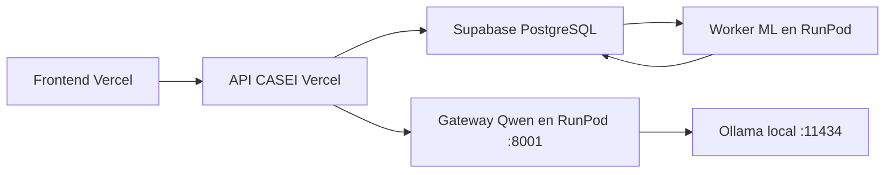

# Guia detallada para actualizar CASEI en RunPod

## 1. Objetivo

Actualizar el Pod existente para ejecutar dentro del mismo contenedor:

1. Ollama con Qwen Instruct y Qwen Embedding.
2. El gateway autenticado de CASEI en el puerto `8001`.
3. El worker ML persistente que consume la cola `ml_model_runs` de Supabase.

La API desplegada en Vercel seguira creando y consultando trabajos. RunPod
reclamara esos trabajos, sincronizara el cardex desde Supabase, ejecutara la
inferencia o el reentrenamiento y publicara los resultados.



## 2. Consideraciones antes de actualizar

- El Pod debe permanecer encendido para procesar trabajos inmediatamente.
- Si el Pod esta apagado, los trabajos permaneceran en `queued` y se
  procesaran cuando vuelva a iniciar.
- Editar un Pod reinicia el contenedor y elimina lo que no este almacenado
  bajo `/workspace` o en un volumen de red.
- Los modelos de Ollama se conservan en `/workspace/ollama/models`.
- El bundle activo de K-Means se incluye dentro de la imagen Docker.
- No se debe colocar la service role de Supabase en el frontend, GitHub,
  Dockerfile, logs ni variables `NEXT_PUBLIC_*`.

La imagen validada localmente se llama:

```text
casei-runpod-worker:test
```

Bundle incluido y validado:

```text
casei-kmeans-pca90-k2-b0c92e1bd722
```

## 3. Preparar una etiqueta versionada

Abrir PowerShell en:

```powershell
Set-Location "C:\Users\govel\OneDrive\Desktop\A - UP Chiapas\9no cuatrimestre\CACEI\academic-segmentation"
```

Definir una etiqueta que no cambie:

```powershell
$ImageTag = "worker-20260723-01"
```

No reutilizar `latest` como unica etiqueta. Una etiqueta inmutable permite
regresar a la imagen anterior si el worker falla.

## 4. Construir nuevamente la imagen

Aunque ya existe una imagen local de prueba, conviene reconstruirla justo antes
de publicarla:

```powershell
docker build `
  -f deploy/runpod/Dockerfile `
  -t "casei-runpod-worker:$ImageTag" `
  .
```

Validar que la imagen exista:

```powershell
docker image inspect "casei-runpod-worker:$ImageTag" `
  --format "Entrypoint={{json .Config.Entrypoint}} Size={{.Size}}"
```

La entrada esperada es:

```text
["python3","/opt/casei/deploy/runpod/start.py"]
```

Validar el bundle dentro de la imagen:

```powershell
docker run --rm `
  --entrypoint python3 `
  -e CASEI_STRICT_BUNDLE_CHECKSUMS=true `
  "casei-runpod-worker:$ImageTag" `
  -c "from app.services.model_persistence_service import load_persisted_model_bundle; print(load_persisted_model_bundle()['manifest']['model_version'])"
```

Debe imprimir:

```text
casei-kmeans-pca90-k2-b0c92e1bd722
```

## 5. Publicar la imagen

### Opcion A: Docker Hub

Iniciar sesion:

```powershell
docker login
```

Definir el repositorio. Sustituir `TU_USUARIO`:

```powershell
$RegistryImage = "TU_USUARIO/casei-runpod"
```

Etiquetar y publicar:

```powershell
docker tag `
  "casei-runpod-worker:$ImageTag" `
  "${RegistryImage}:$ImageTag"

docker push "${RegistryImage}:$ImageTag"
```

La imagen que se colocara en RunPod sera:

```text
TU_USUARIO/casei-runpod:worker-20260723-01
```

### Opcion B: GitHub Container Registry

Crear un Personal Access Token con permiso `write:packages` y autenticar:

```powershell
$GitHubUser = "Develazquez"
$GitHubToken | docker login ghcr.io -u $GitHubUser --password-stdin
```

No escribir el token directamente en un script o documento.

Etiquetar y publicar:

```powershell
$RegistryImage = "ghcr.io/develazquez/microservice-dm-casei-runpod"

docker tag `
  "casei-runpod-worker:$ImageTag" `
  "${RegistryImage}:$ImageTag"

docker push "${RegistryImage}:$ImageTag"
```

Si el paquete es privado, conectar las credenciales del registro en RunPod.
Para una primera prueba resulta mas sencillo utilizar un repositorio de imagen
publico que no contenga secretos. Los secretos se inyectan en tiempo de
ejecucion y nunca forman parte de la imagen.

## 6. Crear los secretos en RunPod

En la consola de RunPod:

1. Abrir **Secrets**.
2. Seleccionar **Create Secret**.
3. Crear `casei_slm_gateway_api_key`.
4. Usar como valor la misma clave configurada en Vercel para
   `OLLAMA_GATEWAY_API_KEY`.
5. Crear `casei_supabase_service_role_key`.
6. Usar como valor la service role del proyecto Supabase.

Referencias que se colocaran en el template:

```text
{{ RUNPOD_SECRET_casei_slm_gateway_api_key }}
{{ RUNPOD_SECRET_casei_supabase_service_role_key }}
```

RunPod no permite volver a visualizar el valor de un secreto guardado. Si hay
dudas sobre su contenido, actualizar el secreto antes del despliegue.

## 7. Editar el template de RunPod

1. Abrir **Templates**.
2. Localizar el template actual de CASEI.
3. Seleccionar **Edit Template**.
4. Cambiar **Container Image** por la etiqueta publicada.
5. Conservar una GPU: RTX 4000 Ada o RTX A4000.
6. Configurar al menos 30 GB de container disk.
7. Conservar un volumen de 40 GB montado en `/workspace`.
8. Exponer `8001/http`.
9. Dejar **Docker Entrypoint** y **Docker Start Command** vacios para respetar
   el `ENTRYPOINT` definido en la imagen.

No exponer `11434`. Ollama solo debe ser accesible dentro del contenedor.

## 8. Variables de entorno del template

### Gateway y modelos

```env
CASEI_SLM_GATEWAY_API_KEY={{ RUNPOD_SECRET_casei_slm_gateway_api_key }}
OLLAMA_BASE_URL=http://127.0.0.1:11434
OLLAMA_MODEL=qwen3:4b-instruct-2507-q4_K_M
OLLAMA_EMBEDDING_MODEL=qwen3-embedding:0.6b
OLLAMA_TIMEOUT_SECONDS=12
OLLAMA_WARMUP_TIMEOUT_SECONDS=120
OLLAMA_KEEP_ALIVE=30m
OLLAMA_MAX_LOADED_MODELS=2
OLLAMA_NUM_PARALLEL=1
```

### Supabase del lado servidor

```env
CASEI_SUPABASE_URL=https://msgqdkhjdpidwbhwnhgr.supabase.co
CASEI_SUPABASE_SERVICE_ROLE_KEY={{ RUNPOD_SECRET_casei_supabase_service_role_key }}
CASEI_DB_MODE=supabase
CASEI_ARTIFACT_MODE=local
```

### Worker ML

```env
CASEI_ENVIRONMENT=production
CASEI_ML_WORKER_ENABLED=true
CASEI_AUTO_INFERENCE_ENABLED=true
CASEI_ML_WORKER_ID=worker-runpod-1
CASEI_ML_POLL_SECONDS=5
CASEI_ML_JOB_TIMEOUT_SECONDS=900
CASEI_ML_EVENT_DEBOUNCE_SECONDS=60
CASEI_PIPELINE_DATA_SOURCE=auto
CASEI_MODEL_ACTIVATION_MODE=manual
CASEI_STRICT_BUNDLE_CHECKSUMS=true
CASEI_ALLOW_DEV_IDENTITY_HEADERS=false
CASEI_SQLITE_HISTORY=disabled
```

No configurar en RunPod:

```text
NEXT_PUBLIC_SUPABASE_ANON_KEY
NEXT_PUBLIC_SITE_URL
CASEI_WEB_URL
CASEI_CORS_ORIGINS
VERCEL_URL
ACADEMIC_SEGMENTATION_API_URL
```

Esas variables pertenecen a la web o a la API, no al worker.

## 9. Tratar los trabajos duplicados antes de iniciar

Actualmente se detectaron dos trabajos en cola:

```text
f948bbef-c567-4ff0-ad58-31996b0fd729
1f6e4886-51ab-461b-8022-4be3bdd5e283
```

Si ambos corresponden al mismo cardex, conservar solamente el mas reciente.
En Supabase SQL Editor:

```sql
UPDATE public.ml_model_runs
SET status = 'cancelled'
WHERE execution_id = 'f948bbef-c567-4ff0-ad58-31996b0fd729'
  AND status = 'queued';
```

No eliminar filas de `ml_model_runs`. El historial de ejecuciones debe
conservarse.

## 10. Aplicar el cambio al Pod

Actualizar el template no modifica automaticamente un Pod existente.

1. Abrir **Pods**.
2. En el Pod de CASEI, abrir el menu de tres puntos.
3. Seleccionar **Edit Pod**.
4. Verificar la nueva imagen, variables, volumen y puerto.
5. Guardar los cambios.

RunPod reiniciara el Pod. Los datos fuera de `/workspace` se recrearan desde la
imagen. Los modelos almacenados en `/workspace/ollama/models` deben conservarse.

Si la interfaz no permite cambiar la imagen del Pod existente:

1. Detener el Pod anterior, pero no eliminarlo todavia.
2. Desplegar un Pod nuevo desde el template actualizado.
3. Asociar el mismo volumen si la configuracion de RunPod lo permite.
4. Verificar completamente el Pod nuevo.
5. Eliminar el anterior solo despues de confirmar la operacion.

## 11. Verificar los logs de arranque

Abrir **Pods > CASEI > Logs**.

Se esperan mensajes equivalentes a:

```text
Iniciando Ollama: ollama serve
Iniciando gateway CASEI
Iniciando worker ML
CASEI ML worker iniciado. Presiona Ctrl+C para detenerlo.
```

Si falta `Iniciando worker ML`, comprobar:

```env
CASEI_ML_WORKER_ENABLED=true
```

Si el contenedor termina indicando secretos faltantes, revisar:

```env
CASEI_SUPABASE_URL
CASEI_SUPABASE_SERVICE_ROLE_KEY
```

## 12. Verificar el gateway

Definir la URL publica del Pod:

```powershell
$GatewayUrl = "https://POD_ID-8001.proxy.runpod.net"
```

Salud publica:

```powershell
Invoke-RestMethod "$GatewayUrl/health"
```

Debe responder con `status: ok`.

Para `/ready`, utilizar la clave compartida sin escribirla en el comando:

```powershell
$headers = @{
  "X-CASEI-SLM-KEY" = $env:CASEI_SLM_GATEWAY_API_KEY
}

Invoke-RestMethod "$GatewayUrl/ready" -Headers $headers
```

Antes de una demostracion:

```powershell
Invoke-RestMethod `
  "$GatewayUrl/warmup" `
  -Method Post `
  -Headers $headers
```

Un `GET /` con estado `404` es normal. El endpoint de monitoreo correcto es
`/health`.

## 13. Verificar el worker en Supabase

Ejecutar:

```sql
SELECT
  execution_id,
  run_type,
  status,
  progress,
  claimed_by,
  heartbeat_at,
  error_message,
  created_at,
  finished_at
FROM public.ml_model_runs
ORDER BY created_at DESC
LIMIT 10;
```

Cuando el worker funciona, el trabajo cambia:

```text
queued
claimed
validating
processing
publishing
completed
```

Y debe mostrar:

```text
claimed_by = worker-runpod-1
progress = 100
```

## 14. Prueba completa desde CASEI web

1. Iniciar sesion como director.
2. Abrir `/director/importar-historial`.
3. Cargar o actualizar el cardex.
4. Verificar que la importacion finalice sin advertencias bloqueantes.
5. Abrir `/director/analitica/segmentacion`.
6. Seleccionar **Procesar segmentacion**.
7. Copiar el `execution_id`.
8. Revisar el avance en la interfaz.
9. Confirmar en Supabase que `claimed_by` sea `worker-runpod-1`.
10. Esperar `completed`.
11. Recargar el dashboard y revisar asignaciones, metricas y busqueda.

Para tutor:

1. Cargar una lista de tutorados o calificaciones.
2. Revisar y confirmar el lote.
3. Con `CASEI_AUTO_INFERENCE_ENABLED=true`, el worker consolidara los eventos y
   creara la inferencia correspondiente.

## 15. Variables que permanecen en Vercel API

La API debe continuar apuntando al gateway publico:

```env
CASEI_SLM_ENABLED=true
CASEI_SEARCH_MODE=auto
OLLAMA_GATEWAY_URL=https://POD_ID-8001.proxy.runpod.net
OLLAMA_GATEWAY_API_KEY=misma-clave-del-secreto-de-runpod
```

En Vercel, `OLLAMA_BASE_URL=http://127.0.0.1:11434` no conecta con RunPod. La
integracion remota utiliza `OLLAMA_GATEWAY_URL`.

## 16. Rollback

Si el despliegue nuevo falla:

1. Editar el Pod.
2. Restaurar la etiqueta anterior de la imagen.
3. Guardar y reiniciar.
4. Mantener los trabajos en `queued`; no eliminarlos.

Para desactivar solo el worker y conservar Qwen:

```env
CASEI_ML_WORKER_ENABLED=false
```

Al reiniciar, el gateway continuara funcionando, pero los trabajos ML quedaran
en cola.

## 17. Problemas frecuentes

### El job permanece en `queued`

- Confirmar que el Pod este encendido.
- Buscar `CASEI ML worker iniciado` en logs.
- Verificar `CASEI_ML_WORKER_ENABLED=true`.
- Revisar la service role y la URL de Supabase.
- Confirmar que las migraciones 015, 016 y 017 esten aplicadas.

### El contenedor se reinicia continuamente

- Revisar el primer error de los logs.
- Verificar secretos obligatorios.
- Confirmar que el container disk tenga espacio.
- No sobrescribir el entrypoint del Dockerfile.

### Error de bundle incompleto o checksums

- Confirmar que se usa la nueva etiqueta versionada.
- Ejecutar la validacion local del bundle.
- No copiar artifacts manualmente dentro del Pod.
- Mantener `CASEI_STRICT_BUNDLE_CHECKSUMS=true`.

### RunPod responde `404` en `/`

Es esperado. Utilizar:

```text
/health
/ready
/warmup
/interpret
/embed
```

### Los trabajos se procesan dos veces

- Revisar trabajos duplicados en `ml_model_runs`.
- Usar un solo worker durante la primera prueba.
- Mantener identificadores distintos si posteriormente se configura mas de un
  worker.

## 18. Limitacion actual de persistencia

El bundle base esta versionado dentro de la imagen. Los resultados se publican
en Supabase, pero los artifacts nuevos creados por un reentrenamiento pueden
perderse si se reemplaza el contenedor antes de publicarlos o respaldarlos.

Para demostraciones e inferencia con el modelo activo, la configuracion actual
es suficiente. Antes de habilitar reentrenamiento productivo automatico se
debe persistir el registro de modelos bajo `/workspace` o implementar un
almacenamiento versionado de artifacts.

## 19. Documentacion oficial consultada

- [Crear templates personalizados](https://docs.runpod.io/pods/templates/create-custom-template)
- [Administrar templates](https://docs.runpod.io/pods/templates/manage-templates)
- [Variables de entorno](https://docs.runpod.io/pods/templates/environment-variables)
- [Administrar secretos](https://docs.runpod.io/pods/templates/secrets)
- [Actualizar Pods](https://docs.runpod.io/pods/manage-pods)
